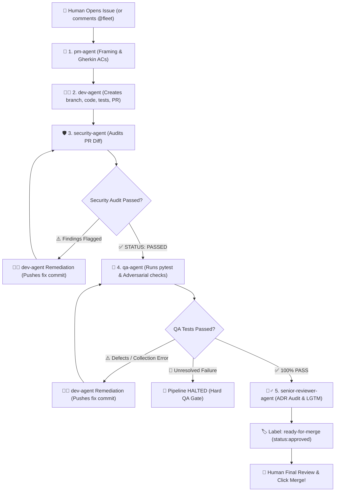

# 🛸 Agentic Fleet: Centralized Autonomous Multi-Agent SDLC

[](https://github.com/dipeshsingh2012/agentic-fleet/actions)
[](https://opensource.org/licenses/MIT)
[](https://www.python.org/downloads/)
[](https://ai.google.dev/)

`agentic-fleet` is the centralized, cross-repository agent orchestration engine and source of truth for the **Autonomous 5-Agent SDLC**. 

It decouples agent personas, defensive coding contracts, and cloud CI/CD orchestration from individual target repositories. By adding **one workflow file**, any existing or future repository (Python, TypeScript, Go, Rust, Monorepo) instantly inherits full autonomous development, adversarial QA, multi-tenant security auditing, and human-gated architectural sign-off.

---

## 🌟 The 5 Role-Bound Subagents & Contracts

| Subagent | Persona & Focus | Trigger Event | Output Contract |
| :--- | :--- | :--- | :--- |
| **🎯 `pm-agent`** | **Product Strategy & Framing**<br>Frames user stories, Gherkin Acceptance Criteria (`Given/When/Then`), and RICE prioritization scores. | `issues.opened`, `@pm-agent` | Structured Issue Spec + label `agent:ready-for-dev` |
| **🧑‍💻 `dev-agent`** | **TDD Full-Stack Engineer**<br>Creates isolated branch (`feat/<issue-id>-<slug>`), authors clean code + 100% unit tests, materializes real files, and opens/remediates PRs. | `agent:ready-for-dev`, `@dev-agent`, PR review feedback | Git branch, materialized source & test files, Pull Request, and fix commits |
| **🛡️ `security-agent`** | **Security & Compliance Auditor**<br>Audits git diffs for multi-tenant isolation leaks (`tenant_id` headers), hardcoded secrets, and OWASP flaws. | `pull_request.opened`, `pull_request.synchronize`, `@security-agent` | Security Audit Report with `STATUS: PASSED ✅` or `STATUS: BLOCKED ❌` |
| **🧪 `qa-agent`** | **Adversarial QA & Test Automation**<br>Executes automated test suites (`pytest`), tests edge cases (CSV formula injection, path traversal, DoS streaming, 0-byte inputs), and audits regressions. | `ready-for-qa`, `@qa-agent` | QA Verification Report (`100% PASS ✅` or `STATUS: FAILED ❌`) |
| **🧙‍♂️ `senior-reviewer-agent`** | **Principal Architect & Gatekeeper**<br>Audits diffs against ADRs, validates Sec + QA green checks, submits formal approval (**`LGTM ✅`**), and applies `ready-for-merge`. | Sec + QA passed, `@senior-reviewer-agent` | Architectural Review (`APPROVED LGTM ✅`) + `ready-for-merge` label |

---

## ⚡ Autonomous 5-Stage SDLC Auto-Chaining

When an issue is opened (or `@fleet` is mentioned), `agentic-fleet` runs the entire 5-agent lifecycle autonomously in a single workflow run:



---

## 🧠 Core Engine Capabilities

### 1. 📁 Automated Code File Materializer
* When `dev-agent` generates implementation and test code inside explicit file blocks (e.g. ````python:backend/app/services/csv_service.py````), `agentic-fleet` extracts and writes the real `.py` files into the repository workspace.
* Automatically creates parent directory structures and stages all real files in Git (`git add .`), preventing "markdown-only" PRs.

### 2. 🔍 Dynamic Live Google Model Discovery
* Real-time query to Google AI Studio (`GET /v1beta/models?key=...`) to discover active generation models dynamically.
* Automatically filters out deprecated legacy models (such as `gemini-1.0` and `gemini-1.5`) and selects modern active production models (`gemini-2.5-flash`, `gemini-2.0-flash`, `gemini-2.5-pro`).

### 3. 🛡️ Smart Checkpointing & Stateful Resumption
* Before executing any stage, `@fleet` inspects the existing state and labels of the PR.
* **Zero Duplicate Spam**: Automatically skips already-passed stages (`pm-agent`, initial branch creation, `security:passed`, `qa:passed`).
* **Direct Jump**: If QA has previously flagged defects, `@fleet` jumps directly into `dev-agent` remediation $\rightarrow$ re-tests with QA $\rightarrow$ proceeds to Architect sign-off.

### 4. 🛑 Strict QA Hard Gate
* Test collection errors, broken imports, missing dependencies, or test failures trigger a hard stop:
  * `senior-reviewer-agent` is strictly **blocked from running**.
  * PR is labeled `qa:failed` and `status:changes-requested`.
  * Actionable defect logs are posted directly to the PR.

### 5. 👤 Human-in-the-Loop Final Gate
* `senior-reviewer-agent` finishes the ADR audit and approves the PR (**`LGTM ✅`**), but leaves the final green **Merge pull request** button for the human engineer.

---

## 🔌 Universal Integration Guide (Any Future Project in < 60s)

To connect `agentic-fleet` to **any new or existing repository**:

### Step 1: Configure Repository Secrets
In the target repository's **Settings $\rightarrow$ Secrets and variables $\rightarrow$ Actions**:
* Add `GEMINI_API_KEY`: Your Google AI Studio Gemini API Key.

### Step 2: Enable GitHub Actions Pull Request Permissions
In **Settings $\rightarrow$ Actions $\rightarrow$ General**:
* Under *Workflow permissions*, check **"Allow GitHub Actions to create and approve pull requests"**.

### Step 3: Add the Orchestration Workflow
Create `.github/workflows/agentic-sdlc.yml` in the target repository:

```yaml
name: Autonomous Agentic SDLC

run-name: >-
  ${{
    github.event_name == 'issue_comment' && format('💬 {0} on #{1} by @{2}', github.event.comment.body, github.event.issue.number, github.actor) ||
    github.event_name == 'pull_request_review_comment' && format('💬 PR Diff Comment: "{0}" by @{1}', github.event.comment.body, github.actor) ||
    github.event_name == 'pull_request_review' && format('💬 PR Review: "{0}" by @{1}', github.event.review.body, github.actor) ||
    github.event_name == 'issues' && format('🎯 Issue #{0}: {1}', github.event.issue.number, github.event.issue.title) ||
    github.event_name == 'pull_request' && format('🛡️ PR #{0} ({1}): {2}', github.event.pull_request.number, github.event.action, github.event.pull_request.title) ||
    format('🛸 Fleet Workflow: {0}', github.event_name)
  }}

on:
  issues:
    types: [opened, labeled]
  issue_comment:
    types: [created, edited]
  pull_request:
    types: [opened, synchronize, labeled]
  pull_request_review:
    types: [submitted, edited]
  pull_request_review_comment:
    types: [created, edited]

permissions:
  contents: write
  pull-requests: write
  issues: write

jobs:
  agentic-orchestrator:
    name: "Autonomous SDLC Fleet"
    runs-on: ubuntu-latest
    steps:
      - name: Checkout Target Repository
        uses: actions/checkout@v4
        with:
          fetch-depth: 0

      - name: Checkout Central Agent Fleet
        uses: actions/checkout@v4
        with:
          repository: dipeshsingh2012/agentic-fleet
          path: .agentic-fleet

      - name: Run Agentic Fleet Action
        uses: ./.agentic-fleet
        with:
          gemini-api-key: ${{ secrets.GEMINI_API_KEY }}
          github-token: ${{ secrets.GITHUB_TOKEN }}
```

---

## 💬 ChatOps Command Reference

You can interact with the fleet directly via GitHub comments on Issues and Pull Requests:

| ChatOps Command | Action Taken |
| :--- | :--- |
| **`@fleet run pipeline`** | Runs the full stateful 5-agent pipeline (skips passed stages, fixes defects, reviews). |
| **`@dev-agent <instructions>`** | Invokes developer to create a feature or push remediation commits to the PR branch. |
| **`@security-agent please audit`** | Triggers standalone multi-tenant isolation and secret audit on the PR diff. |
| **`@qa-agent please test`** | Triggers automated test suite execution and adversarial edge case validation. |
| **`@senior-reviewer-agent please review`** | Audits architectural ADR compliance and submits formal PR approval. |

---

## 💻 Local Development & Testing

### Installation
```bash
# Clone the central fleet
git clone https://github.com/dipeshsingh2012/agentic-fleet.git
cd agentic-fleet

# Install dependencies in virtual environment
task install
```

### Run Test Suite
```bash
# Run all 23 unit & integration tests
task test

# Run fast unit tests
task test:unit
```

### Dry-Run CLI Simulation
```bash
# Simulate full autonomous pipeline
.venv/bin/python -m src.cli --event-name issues --agent autonomous --dry-run

# Test a specific agent in isolation
.venv/bin/python -m src.cli --agent security --dry-run
```

---

## 📂 Repository Structure

```
agentic-fleet/
├── .github/
│   └── workflows/
│       ├── central-runner.yml       # Reusable central workflow
│       └── ci.yml                   # Automated CI test suite
├── action.yml                       # Composite GitHub Action entrypoint
├── prompts/                         # Version-controlled agent system prompts
│   ├── pm-agent.prompt.md           # Product Management & Gherkin ACs
│   ├── dev-agent.prompt.md          # Full-Stack TDD & Code Materialization
│   ├── security-agent.prompt.md     # Multi-Tenant & Secret Auditor
│   ├── qa-agent.prompt.md           # Adversarial QA & Test Automation
│   └── senior-reviewer-agent.prompt.md # Principal Architect & ADR Gatekeeper
├── src/                             # Core orchestration engine
│   ├── __init__.py
│   ├── cli.py                       # Typer CLI & GitHub Step Summary generator
│   ├── event_router.py              # Event router, code materializer & pipeline runner
│   ├── github_client.py             # Asynchronous GitHub REST API client
│   ├── llm_runner.py                # Dynamic Google model discovery & LLM runner
│   └── test_harness.py              # Test harness with automatic PYTHONPATH resolution
├── tests/                           # Comprehensive test suite (23 tests)
│   ├── test_cli.py
│   ├── test_event_router.py
│   ├── test_github_client.py
│   ├── test_llm_runner.py
│   └── test_test_harness.py
├── pyproject.toml                   # Packaging & pytest config
├── requirements.txt                 # Dependencies
├── Taskfile.yml                     # Task runner
└── README.md                        # Master documentation & integration guide
```

---

## 📄 License
MIT License. Created by [Dipesh Singh](https://github.com/dipeshsingh2012).
