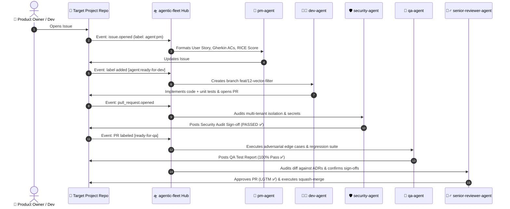

# 🛸 agentic-fleet: Centralized GitHub-Native Multi-Agent SDLC Orchestrator

[](https://github.com/dipeshsingh2012/agentic-fleet/actions)
[](https://opensource.org/licenses/MIT)
[](https://www.python.org/downloads/)

`agentic-fleet` is the centralized, cross-repository agent orchestration engine and source of truth for the **Autonomous 5-Agent SDLC**.

It decouples agent personas, system prompt contracts, and orchestration logic from individual application repositories, enabling zero-install, cloud-native automation across GitHub Issues, Pull Requests, and ChatOps.

---

## 🌟 The 5 Role-Bound Subagents

| Subagent | Persona & Focus | Trigger Event | Output Contract |
| :--- | :--- | :--- | :--- |
| **🎯 `pm-agent`** | **Product Strategy & Framing**<br>Frames user stories, Gherkin Acceptance Criteria (`Given/When/Then`), and RICE prioritization scores. | `issues.opened` (with `agent:pm`), `@pm-agent` | Structured Issue Spec + label `agent:ready-for-dev` |
| **🧑‍💻 `dev-agent`** | **TDD Full-Stack Engineer**<br>Creates isolated branch (`feat/<issue-id>`), writes typed code + 100% unit tests, and drafts PR. | `issues.labeled` (`agent:ready-for-dev`), `@dev-agent` | Git branch, commit diffs, Pull Request, and review fixes |
| **🛡️ `security-agent`** | **Security & Compliance Auditor**<br>Audits diffs for multi-tenant isolation leaks (`tenant_id`), hardcoded secrets, and OWASP flaws. | `pull_request.opened`, `pull_request.synchronize` | Security Audit Report with `STATUS: PASSED/BLOCKED` |
| **🧪 `qa-agent`** | **Adversarial QA & Test Automation**<br>Executes boundary edge cases (0-byte payloads, 400/404/422 responses, DB rollbacks) and full regressions. | `pull_request.labeled` (`ready-for-qa`), `@qa-agent` | QA Verification Report with pass/fail logs |
| **🧙‍♂️ `senior-reviewer-agent`** | **Principal Architect & Gatekeeper**<br>Audits diffs against ADRs, validates Sec + QA green checks, posts `LGTM`, and executes squash & merge. | PR review cycle / All checks green | PR Approval (`LGTM`) + Auto-merge to `main` |

---

## 🔄 End-to-End Workflow



---

## 🔌 Connecting Target Projects (Integration Guide)

In any target repository (e.g., `RFQEngine`), create `.github/workflows/agentic-sdlc.yml`:

```yaml
name: Autonomous Agentic SDLC

on:
  issues:
    types: [opened, labeled]
  issue_comment:
    types: [created]
  pull_request:
    types: [opened, synchronize, labeled]
  pull_request_review_comment:
    types: [created]

jobs:
  agentic-orchestration:
    runs-on: ubuntu-latest
    steps:
      - name: Checkout Target Repository
        uses: actions/checkout@v4

      - name: Checkout Central Agent Fleet
        uses: actions/checkout@v4
        with:
          repository: dipeshsingh2012/agentic-fleet
          path: .agentic-fleet

      - name: Run Agentic Fleet Action
        uses: ./.agentic-fleet
        with:
          gemini-api-key: ${{ secrets.GEMINI_API_KEY }}
          github-token: ${{ secrets.GITHUB_TOKEN }}
```

---

## 💻 Local Development & Testing

### Installation
```bash
# Clone the repository
git clone https://github.com/dipeshsingh2012/agentic-fleet.git
cd agentic-fleet

# Install with Taskfile
task install
```

### Run Tests
```bash
# Run full pytest suite
task test

# Run quick unit tests
task test:unit
```

### Dry-Run CLI Simulation
```bash
# Simulate issue opened event
task dry-run

# Test a specific agent explicitly
.venv/bin/python -m src.cli --agent security --dry-run
```

---

## 📂 Repository Structure

```
agentic-fleet/
├── .github/
│   └── workflows/
│       ├── central-runner.yml       # Reusable workflow
│       └── ci.yml                   # CI test suite for agentic-fleet
├── action.yml                       # Composite GitHub Action entrypoint
├── prompts/                         # Version-controlled agent system prompts
│   ├── pm-agent.prompt.md
│   ├── dev-agent.prompt.md
│   ├── security-agent.prompt.md
│   ├── qa-agent.prompt.md
│   └── senior-reviewer-agent.prompt.md
├── src/                             # Core orchestration engine
│   ├── __init__.py
│   ├── cli.py                       # Typer CLI entrypoint
│   ├── event_router.py              # Webhook / Action event dispatcher
│   ├── github_client.py             # Asynchronous GitHub REST API client
│   ├── llm_runner.py                # Gemini API runner & prompt loader
│   └── test_harness.py              # Cloud test execution engine
├── tests/                           # Unit and integration test suite
│   ├── test_cli.py
│   ├── test_event_router.py
│   ├── test_github_client.py
│   ├── test_llm_runner.py
│   └── test_test_harness.py
├── pyproject.toml                   # Packaging & pytest config
├── requirements.txt                 # Dependencies
├── Taskfile.yml                     # Task runner
└── README.md                        # Documentation & guides
```
