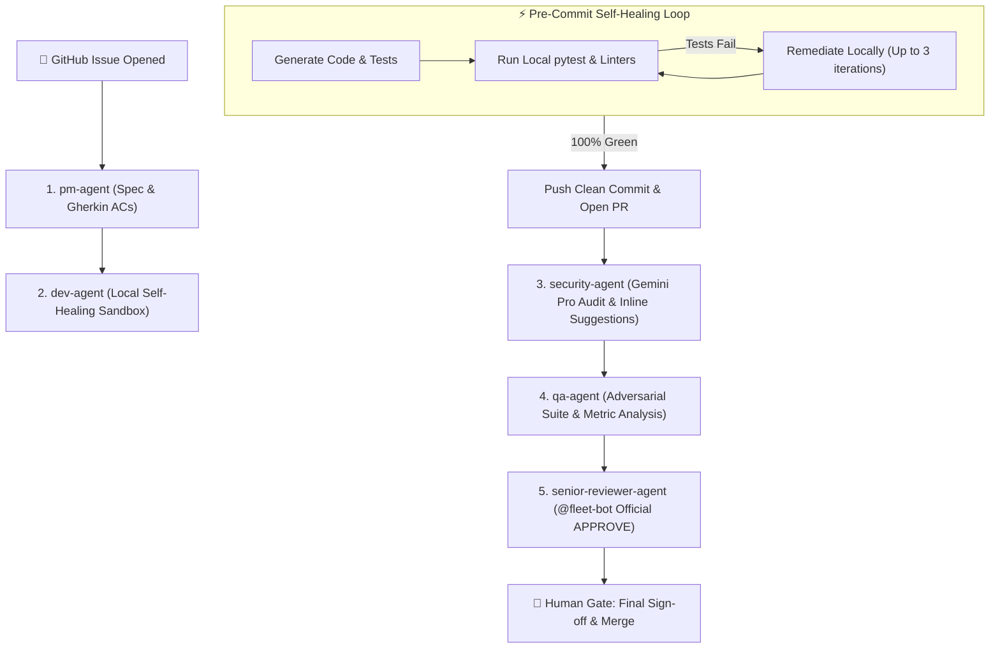

# RFC-001: Autonomous SDLC Fleet Evolution & Architecture Roadmap

- **Status**: PROPOSED
- **Author**: Autonomous SDLC Core Team
- **Created**: 2026-08-31
- **Target Repository**: `dipeshsingh2012/agentic-fleet`

---

## Executive Summary

`agentic-fleet` has successfully established a 5-agent autonomous software engineering lifecycle (**pm-agent**, **dev-agent**, **security-agent**, **qa-agent**, **senior-reviewer-agent**) integrated directly into GitHub Actions with live runtime test execution and 360-degree context awareness.

This RFC outlines the strategic architectural roadmap to elevate `agentic-fleet` from **Level 3 (Reactive Multi-Agent System)** to **Level 4 (Proactive Self-Healing & Distributed SDLC Engine)**.

---

## 🏗️ Architectural Overview & Target State



---

## 🚀 The 5 Core Strategic Pillars

### 1. Pre-Commit Self-Healing Sandbox (`dev-agent`)
- **Current Behavior**: `dev-agent` generates code, commits, and pushes immediately to GitHub. If tests fail during `qa-agent` verification, a subsequent commit is pushed to fix the issues.
- **Proposed Architecture**:
  1. `dev-agent` materializes code and test files to the local runner filesystem.
  2. The runner immediately runs `pytest` and `ruff check` in a local sandbox loop.
  3. If syntax errors, import failures, or test regressions occur, the error output is fed back to `dev-agent` for an immediate local fix (up to 3 iterations).
  4. Only once the test suite is **100% green** does `dev-agent` execute `git commit` and `git push`.
- **Business Impact**: Eliminates noisy, broken intermediate commits on GitHub and drastically accelerates cycle time.

---

### 2. Dedicated GitHub App Identity (`@fleet-architect[bot]`)
- **Current Behavior**: When `senior-reviewer-agent` approves a pull request using the default `GITHUB_TOKEN`, GitHub flags it as a self-review (author bot approving its own PR) and falls back to a comment.
- **Proposed Architecture**:
  - Introduce an optional `REVIEWER_GITHUB_TOKEN` secret or dedicated GitHub App installation (`@fleet-architect[bot]`).
  - Allows `senior-reviewer-agent` to submit official green **`APPROVED`** review states that satisfy enterprise branch protection rules.
- **Business Impact**: Seamless integration with strict enterprise compliance and automated merge queues.

---

### 3. Native GitHub Inline Code Suggestions
- **Current Behavior**: Reviews are posted as markdown summaries on the PR conversation tab.
- **Proposed Architecture**:
  - Enhance `GitHubClient` with `POST /repos/{owner}/{repo}/pulls/{pull_number}/comments` to place inline suggestions directly on modified lines of code:
    ````markdown
    ```suggestion
    val_str = str(value).strip() if value is not None else ""
    ```
    ````
  - Enable `security-agent` and `senior-reviewer-agent` to pinpoint exact line numbers for security fixes and refactors.
- **Business Impact**: Allows human engineers to accept proposed fixes in the GitHub web UI with a single click.

---

### 4. Multi-Model Tiering & Specialization
- **Current Behavior**: Fleet uses dynamic discovery across Google Gemini endpoints.
- **Proposed Architecture**:
  - **`Gemini 2.5 Flash`**: High-velocity tasks (`pm-agent` user stories, `dev-agent` unit tests, `qa-agent` metric formatting).
  - **`Gemini 2.5 Pro`**: Deep reasoning tasks (`security-agent` BOLA/secrets scans, `senior-reviewer-agent` architectural compliance).
- **Business Impact**: Optimizes execution speed and API cost while deploying maximum cognitive reasoning power for security and architectural reviews.

---

### 5. Fleet Observability & Executive Metrics (`GITHUB_STEP_SUMMARY`)
- **Current Behavior**: Execution logs are streamed to standard GitHub Actions console output.
- **Proposed Architecture**:
  - Automatically generate rich Markdown tables in `$GITHUB_STEP_SUMMARY`:
    - **Cycle Time & MTTR**: Time from issue creation to merge readiness.
    - **Test Coverage**: Total tests collected, passed, and execution duration.
    - **Token Usage & Cost**: Real-time token accounting per agent stage.
- **Business Impact**: Complete auditability and visibility for engineering leadership.

---

## 📅 Phased Implementation Plan

| Milestone | Deliverable | Target Timeline |
| :--- | :--- | :--- |
| **Phase 1** | Pre-Commit Self-Healing Sandbox in `dev-agent` | Sprint 1 |
| **Phase 2** | Dedicated Reviewer Token (`REVIEWER_GITHUB_TOKEN`) | Sprint 1 |
| **Phase 3** | Inline Code Suggestions for Security & Senior Reviewer | Sprint 2 |
| **Phase 4** | Multi-Model Specialization (`Flash` vs `Pro`) | Sprint 2 |
| **Phase 5** | Executive Telemetry & `$GITHUB_STEP_SUMMARY` Dashboards | Sprint 3 |

---

## 💬 Feedback & Discussion
Please submit comments, feedback, and approvals directly via Pull Request reviews or issue discussions on `dipeshsingh2012/agentic-fleet`.
